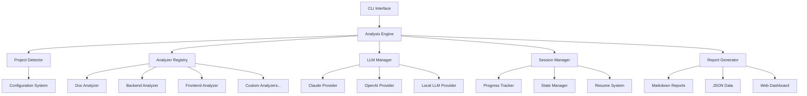

# 🏗️ AI Code Analyzer - Architecture Documentation

**Last Updated**: 2025-08-07  
**Version**: 1.0 (Initial Design)  
**Status**: Design Phase

---

## 🎯 System Overview

**AI Code Analyzer** is a modular, intelligent code analysis framework that leverages multiple Large Language Models (LLMs) to provide comprehensive project insights with advanced quota management, resume capabilities, and multi-project type support.

### Core Principles

1. **Modularity**: Plugin-based architecture for analyzers and LLM providers
2. **Intelligence**: Smart quota management, auto-resume, and adaptive analysis
3. **Flexibility**: Configuration-driven behavior supporting diverse project types
4. **Reliability**: Comprehensive error handling and fallback mechanisms
5. **User Experience**: Beautiful terminal UI with rich progress indicators

---

## 🏛️ High-Level Architecture



---

## 📦 Module Design

### 🎮 CLI Interface (`src/ai_analyzer/cli/`)

**Purpose**: User interaction and command-line interface

```python
# cli/main.py
import typer
from rich.console import Console

app = typer.Typer(rich_markup_mode="rich")
console = Console()

@app.command()
async def analyze(
    path: Path = typer.Argument(".", help="Project path to analyze"),
    config: Optional[Path] = typer.Option(None, "--config", "-c"),
    resume: bool = typer.Option(False, "--resume", "-r"),
    llm: str = typer.Option("claude", "--llm", "-l"),
) -> None:
    """Analyze project with AI-powered insights."""
    pass
```

**Key Features**:
- Rich help system with beautiful formatting
- Interactive configuration setup
- Progress visualization with live updates
- Command composition and chaining

### 🧠 Analysis Engine (`src/ai_analyzer/engine/`)

**Purpose**: Core orchestration and workflow management

```python
# engine/analyzer.py
from abc import ABC, abstractmethod
from typing import AsyncIterator

class AnalysisEngine:
    """Main analysis orchestration engine."""
    
    def __init__(self, config: AnalysisConfig):
        self.config = config
        self.session = SessionManager(config)
        self.llm_manager = LLMManager(config)
        self.analyzer_registry = AnalyzerRegistry()
    
    async def analyze_project(self, path: Path) -> AnalysisResult:
        """Run comprehensive project analysis."""
        # Detect project type
        project_type = await self.detect_project_type(path)
        
        # Get appropriate analyzers
        analyzers = self.analyzer_registry.get_analyzers(project_type)
        
        # Run analysis with resume capability
        async with self.session.create_session() as session:
            async for result in self.run_analyzers(analyzers, path):
                await session.save_checkpoint(result)
                yield result
```

**Key Features**:
- Async workflow orchestration
- Intelligent checkpoint saving
- Error recovery and retry logic
- Progress tracking and reporting

### 🔍 Project Detection (`src/ai_analyzer/detection/`)

**Purpose**: Intelligent project type identification

```python
# detection/detector.py
from enum import Enum
from dataclasses import dataclass

class ProjectType(Enum):
    PYTHON_BACKEND = "python_backend"
    JAVASCRIPT_FRONTEND = "javascript_frontend"
    REACT_FRONTEND = "react_frontend"
    FULL_STACK = "full_stack"
    MOBILE_FLUTTER = "mobile_flutter"
    DEVOPS = "devops"
    UNKNOWN = "unknown"

@dataclass
class ProjectSignature:
    """Configuration for detecting specific project types."""
    name: str
    required_files: list[str]
    optional_files: list[str]
    directory_patterns: list[str]
    confidence_weight: float

class ProjectDetector:
    """Intelligent project type detection."""
    
    async def detect_project_types(self, path: Path) -> list[ProjectType]:
        """Detect all applicable project types in the given path."""
        signatures = await self.load_project_signatures()
        detected_types = []
        
        for signature in signatures:
            confidence = await self.calculate_confidence(path, signature)
            if confidence > self.config.detection_threshold:
                detected_types.append((signature.project_type, confidence))
        
        return sorted(detected_types, key=lambda x: x[1], reverse=True)
```

**Key Features**:
- Multi-project type support (monorepos)
- Confidence-based detection
- Configurable detection rules
- Custom project type definitions

### 🔌 Analyzer Registry (`src/ai_analyzer/analyzers/`)

**Purpose**: Plugin system for different analysis types

```python
# analyzers/base.py
from abc import ABC, abstractmethod

class BaseAnalyzer(ABC):
    """Base class for all analyzers."""
    
    @property
    @abstractmethod
    def name(self) -> str:
        """Human-readable analyzer name."""
        pass
    
    @property
    @abstractmethod
    def supported_project_types(self) -> list[ProjectType]:
        """Project types this analyzer supports."""
        pass
    
    @abstractmethod
    async def analyze(self, context: AnalysisContext) -> AnalysisResult:
        """Perform the analysis."""
        pass
    
    @abstractmethod
    async def can_resume(self, checkpoint: dict) -> bool:
        """Check if analysis can be resumed from checkpoint."""
        pass

# analyzers/documentation.py
class DocumentationAnalyzer(BaseAnalyzer):
    """Analyzes project documentation quality and completeness."""
    
    name = "Documentation Analysis"
    supported_project_types = [ProjectType.PYTHON_BACKEND, ProjectType.FULL_STACK]
    
    async def analyze(self, context: AnalysisContext) -> AnalysisResult:
        """Analyze documentation structure and quality."""
        docs_path = context.project_path / "docs"
        readme_path = context.project_path / "README.md"
        
        prompt = await self.build_analysis_prompt(docs_path, readme_path)
        response = await context.llm.analyze(prompt)
        
        return AnalysisResult(
            analyzer_name=self.name,
            summary=response.summary,
            findings=response.findings,
            recommendations=response.recommendations,
            score=response.score
        )
```

**Key Features**:
- Plugin discovery and registration
- Type-safe analyzer interfaces
- Resume capability for each analyzer
- Configurable analysis depth

### 🤖 LLM Management (`src/ai_analyzer/llm/`)

**Purpose**: Multi-provider LLM integration with intelligent routing

```python
# llm/manager.py
from typing import Protocol

class LLMProvider(Protocol):
    """Protocol for LLM providers."""
    
    async def analyze(self, prompt: str, **kwargs) -> LLMResponse:
        """Send analysis request to the LLM."""
        ...
    
    async def check_quota(self) -> QuotaStatus:
        """Check current quota status."""
        ...
    
    async def estimate_cost(self, prompt: str) -> float:
        """Estimate cost for the given prompt."""
        ...

class LLMManager:
    """Intelligent LLM provider management."""
    
    def __init__(self, config: LLMConfig):
        self.providers = self._load_providers(config)
        self.quota_manager = QuotaManager(config)
        self.cost_tracker = CostTracker()
    
    async def analyze(self, prompt: str, **kwargs) -> LLMResponse:
        """Analyze with intelligent provider selection."""
        # Check quota and costs
        available_providers = await self.quota_manager.get_available_providers()
        
        # Select best provider based on cost, speed, and quota
        provider = await self.select_optimal_provider(available_providers, prompt)
        
        try:
            response = await provider.analyze(prompt, **kwargs)
            await self.cost_tracker.record_usage(provider, response)
            return response
        except QuotaExhaustedError:
            # Try next provider or schedule resume
            return await self.handle_quota_exhaustion(prompt, provider)
```

**Key Features**:
- Multiple LLM provider support
- Intelligent provider selection
- Quota monitoring and management
- Cost optimization
- Automatic failover

### 💾 Session Management (`src/ai_analyzer/session/`)

**Purpose**: State persistence and resume capability

```python
# session/manager.py
import json
from datetime import datetime
from pathlib import Path

@dataclass
class SessionState:
    """Current analysis session state."""
    session_id: str
    project_path: Path
    project_types: list[ProjectType]
    started_at: datetime
    current_analyzer: Optional[str]
    completed_analyzers: list[str]
    failed_analyzers: list[str]
    checkpoints: dict[str, Any]
    quota_exhausted: bool
    resume_scheduled_at: Optional[datetime]

class SessionManager:
    """Manages analysis sessions and resume capability."""
    
    async def create_session(self, project_path: Path) -> Session:
        """Create new analysis session."""
        session_id = self.generate_session_id()
        state = SessionState(
            session_id=session_id,
            project_path=project_path,
            project_types=await self.detect_project_types(project_path),
            started_at=datetime.utcnow(),
            current_analyzer=None,
            completed_analyzers=[],
            failed_analyzers=[],
            checkpoints={},
            quota_exhausted=False,
            resume_scheduled_at=None
        )
        
        await self.save_session_state(state)
        return Session(state, self)
    
    async def resume_session(self, session_id: str) -> Session:
        """Resume existing analysis session."""
        state = await self.load_session_state(session_id)
        if not state:
            raise SessionNotFoundError(f"Session {session_id} not found")
        
        return Session(state, self)
```

**Key Features**:
- Persistent session state
- Checkpoint-based resume
- Intelligent scheduling for quota limits
- Session cleanup and management

### 📊 Configuration System (`src/ai_analyzer/config/`)

**Purpose**: Flexible, validated configuration management

```python
# config/settings.py
from pydantic import BaseSettings, Field, validator

class LLMProviderConfig(BaseSettings):
    """Configuration for individual LLM providers."""
    name: str
    enabled: bool = True
    api_key: Optional[str] = None
    base_url: Optional[str] = None
    max_tokens: int = Field(default=4000, ge=100, le=32000)
    timeout_seconds: int = Field(default=300, ge=30, le=3600)
    retry_attempts: int = Field(default=3, ge=1, le=10)
    cost_per_token: float = Field(default=0.0, ge=0.0)

class AnalysisConfig(BaseSettings):
    """Main analysis configuration."""
    project_path: Path
    output_dir: Path = Field(default_factory=lambda: Path("./analysis_results"))
    
    # LLM Configuration
    llm_providers: dict[str, LLMProviderConfig]
    preferred_provider: str = "claude"
    enable_quota_management: bool = True
    enable_cost_optimization: bool = True
    
    # Analysis Configuration
    analysis_depth: int = Field(default=3, ge=1, le=5)
    enable_deep_dive: bool = True
    max_parallel_analyzers: int = Field(default=3, ge=1, le=10)
    
    # Session Configuration
    enable_resume: bool = True
    checkpoint_interval: int = Field(default=300, ge=60)  # seconds
    session_timeout: int = Field(default=7200, ge=600)  # seconds
    
    class Config:
        env_prefix = "AI_ANALYZER_"
        env_file = ".env"
        
    @validator('project_path')
    def validate_project_path(cls, v):
        if not v.exists():
            raise ValueError(f"Project path does not exist: {v}")
        return v
```

**Key Features**:
- Type-safe configuration with Pydantic
- Environment variable support
- Configuration validation
- Hierarchical configuration loading

---

## 🔄 Data Flow

### Analysis Workflow

1. **Initialization**
   ```
   CLI → Config Loading → Project Detection → Session Creation
   ```

2. **Analysis Execution**
   ```
   Analyzer Selection → LLM Provider Selection → Analysis Request → Result Processing
   ```

3. **State Management**
   ```
   Checkpoint Saving → Progress Tracking → Resume Point Creation
   ```

4. **Output Generation**
   ```
   Result Aggregation → Report Generation → File Output
   ```

### Error Handling Flow

1. **Quota Exhaustion**
   ```
   Quota Detection → Session Suspension → Resume Script Generation → Scheduled Resume
   ```

2. **Network Errors**
   ```
   Error Detection → Retry Logic → Provider Failover → Graceful Degradation
   ```

3. **Analysis Failures**
   ```
   Error Capture → Fallback Analysis → Partial Results → User Notification
   ```

---

## 🗄️ Data Models

### Core Data Structures

```python
@dataclass
class AnalysisResult:
    """Result from a single analyzer."""
    analyzer_name: str
    project_type: ProjectType
    execution_time: float
    summary: str
    findings: list[Finding]
    recommendations: list[Recommendation]
    score: float
    metadata: dict[str, Any]

@dataclass
class Finding:
    """Individual analysis finding."""
    category: str
    severity: Severity
    title: str
    description: str
    file_path: Optional[Path]
    line_number: Optional[int]
    suggested_fix: Optional[str]

@dataclass
class Recommendation:
    """Actionable recommendation."""
    priority: Priority
    title: str
    description: str
    effort_estimate: str
    impact_level: str
    dependencies: list[str]
```

---

## 🚀 Performance Considerations

### Optimization Strategies

1. **Async I/O**: All file operations and network requests are async
2. **Parallel Analysis**: Multiple analyzers can run concurrently
3. **Caching**: LLM responses cached to avoid duplicate requests
4. **Token Optimization**: Intelligent prompt engineering to minimize costs
5. **Incremental Analysis**: Only analyze changed files when possible

### Scalability Limits

- **Project Size**: Designed for projects up to 100k LOC
- **Concurrent Sessions**: Support for 10+ simultaneous analysis sessions
- **Memory Usage**: Target <1GB RAM for typical analysis
- **Analysis Time**: Target <5 minutes for medium-sized projects

---

## 🔒 Security Considerations

### Data Privacy

- **No Code Upload**: All analysis happens locally or via CLI
- **API Key Security**: Secure storage and transmission of LLM API keys
- **Output Sanitization**: Remove sensitive data from reports
- **Session Isolation**: Each analysis session is isolated

### Error Information

- **Safe Error Messages**: No sensitive information in error logs
- **Audit Trail**: Track all LLM interactions for debugging
- **Secure Defaults**: Conservative security settings by default

---

## 📈 Future Extensibility

### Plugin System

- **Custom Analyzers**: Support for user-defined analyzers
- **Custom LLM Providers**: Plugin interface for new LLM services
- **Custom Output Formats**: Extensible report generation
- **Custom Project Types**: User-defined project type detection

### Integration Points

- **IDE Integration**: VS Code extension, JetBrains plugins
- **CI/CD Integration**: GitHub Actions, GitLab CI
- **Webhook Support**: Real-time notifications and integrations
- **API Server**: REST API for programmatic access

---

**Next Update**: After basic CLI implementation  
**Review Schedule**: Weekly during active development  
**Version Control**: Track major architectural changes
